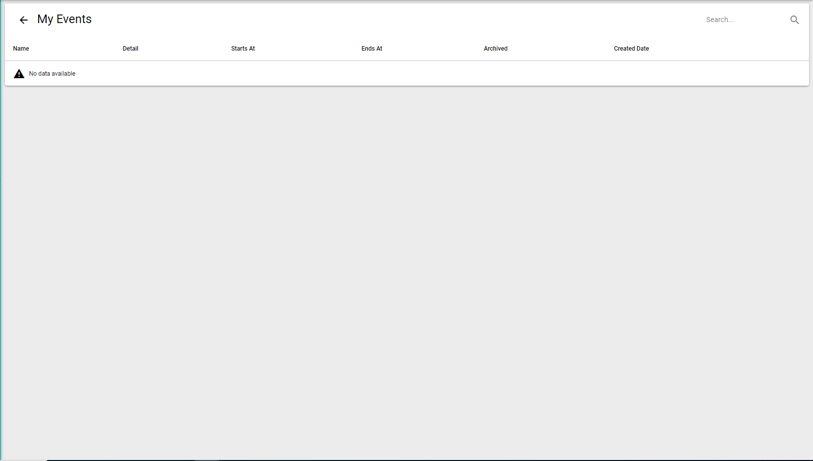

# My Events

The events calendar section is designed for planning various events.

This section can be accessed from the main menu by clicking the icon on the left corner. Events are
added by the company employee's who have access. My events provides the user with a brief and clear
overview of all the events that were added. Each event in the My event is identified by name, detail, and the
created date.