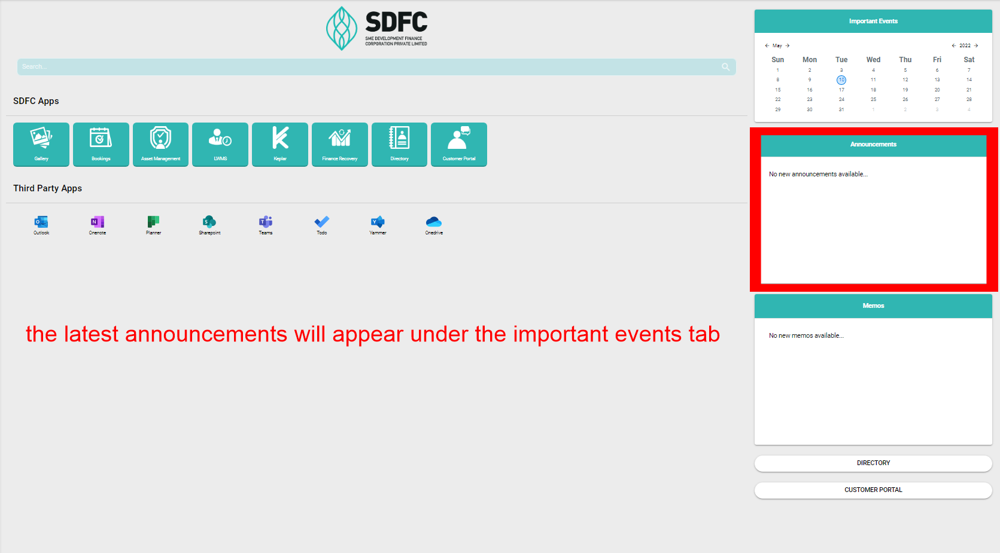

# HomePage

## Left Column

Pressing the hamburger icon on the right will display the following:

- User Profile
- My Requests
- My Quicklinks
- My Events

## Central Column

- Searchbar: type in keywords to the searchbar and it will display the content that you searched for
- SDFC Apps: gives you quick access to a host of functionalities
- Third Party Apps: Allows quick access to office 365 apps

## Right Column

- Important Events: list of upcoming events which are defined in the calendar section
- Announcements: the latest announcements will appear under the important events tab
- Memos: Displays a list of memos
- Directory: Guides you to the directory page where you can find the company structure, committee and an address book
- Customer Portal: This will direct you to the customer portal login page where you need to enter your username and password.

