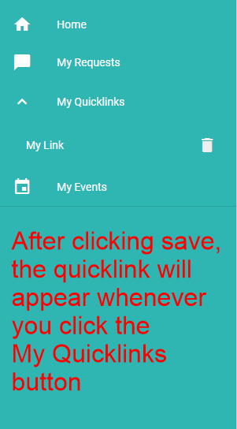
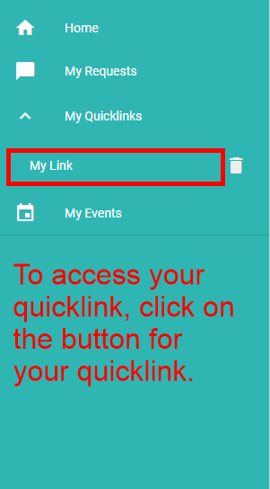
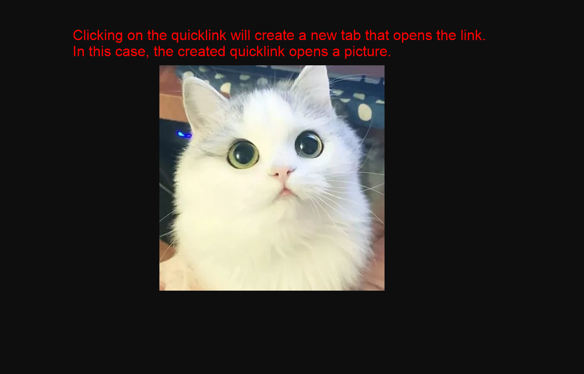

# Quicklink functions

## How to view your quicklinks

After clicking save, the quicklink will appear whenever you click the **My Quicklinks** button.

## How to delete your quicklink

You can click this icon to delete the quicklink

## How to access your quicklink

To access your quicklink, click on the button for your quicklink.

Clicking on the quicklink will create a new tab that opens the link. In this case, the created quicklink opens a picture.

