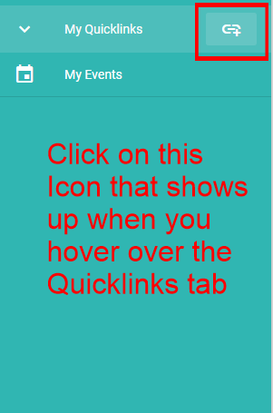

# How to make quicklinks

## Step 1

Click on the icon that shows up whenever you hover over the quicklinks tab.

## Step 2

You will be directed to this form which you can fill to create a quicklink.

## Step 3

Enter a name and url for your quicklink and then click save.