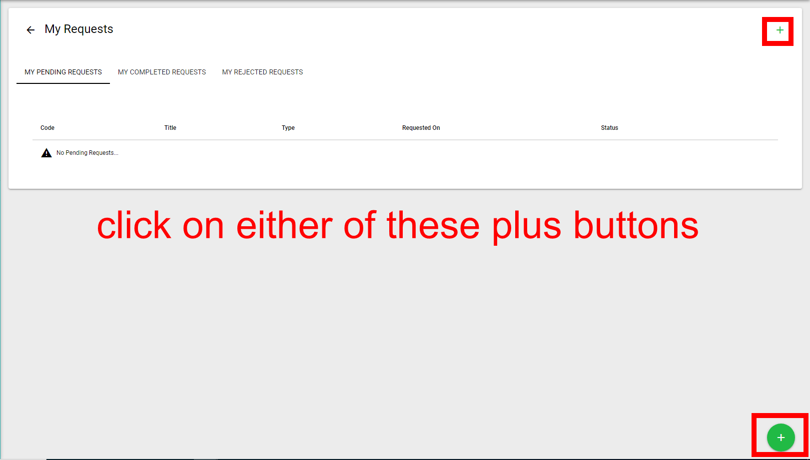
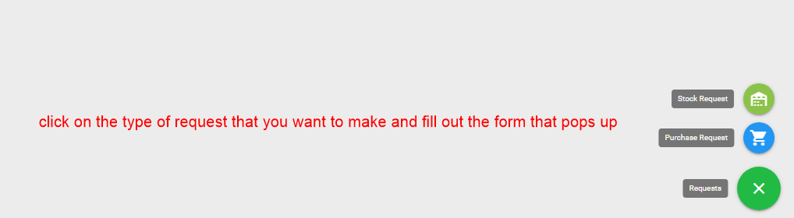
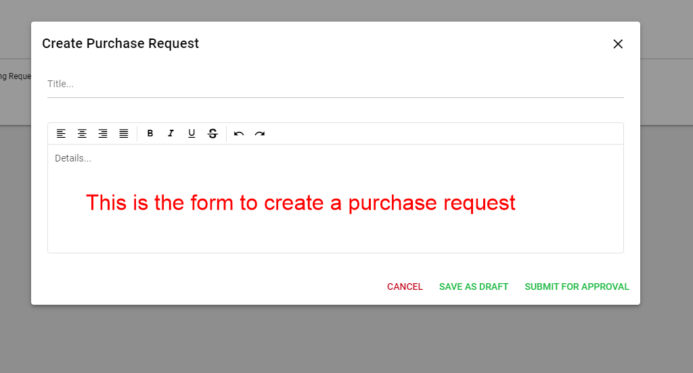
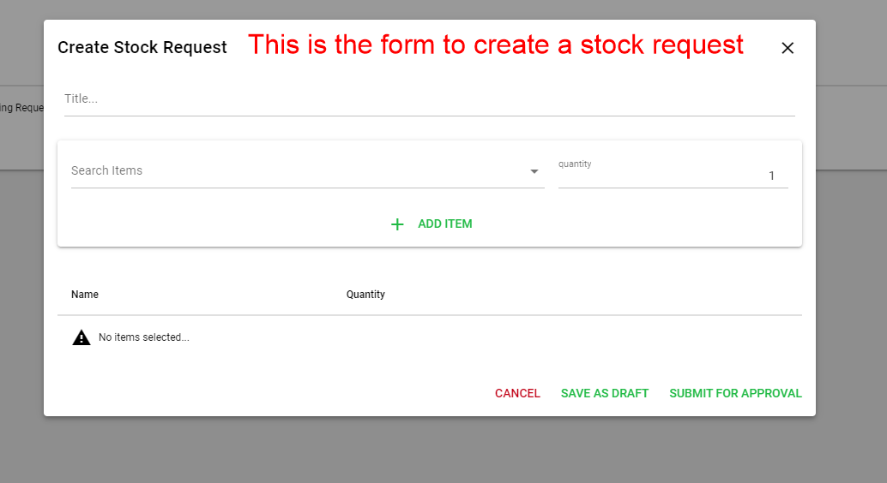
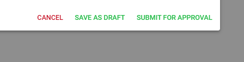
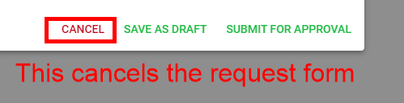
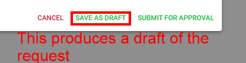
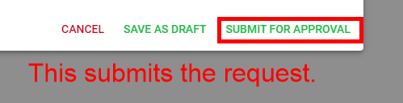

# How to make Requests

## Step 1

Click on either of these buttons

## Step 2

Click on the type of request you want to make and fill out the form that pops up

## Request Forms

This is the form to create a purchase request.

This is the form to create a stock request.

### Request form functions

Both types of request forms will have the following options.

This will cancel the requests form.

This produces a draft of the request.

This submits the request.

