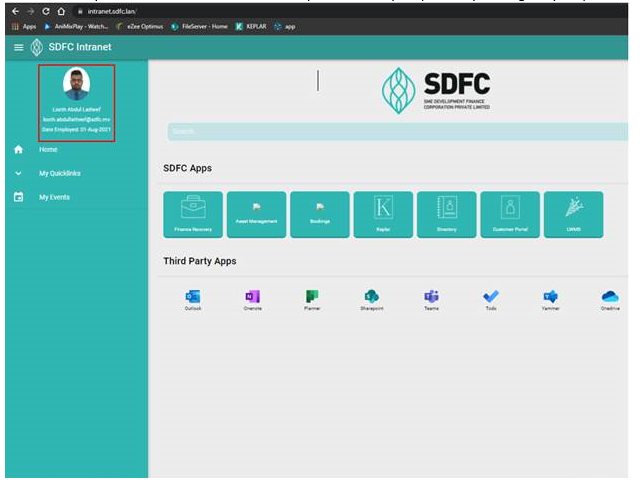
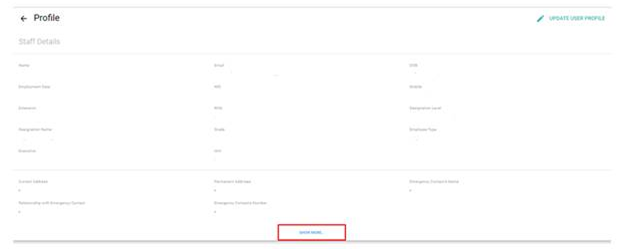
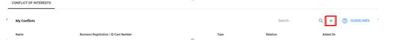

# Conflicts Tutorial

# Step 1

To find and fill your conflict of interest details first please access your profile by clicking the your photo in the top left corner of the Intranet. (highlighted in red in the photo Below)

# Step 2

Once you reach your profile press “Show more” button below

# Step 3

Add your Conflicts of Interest by clicking the “+” Button

